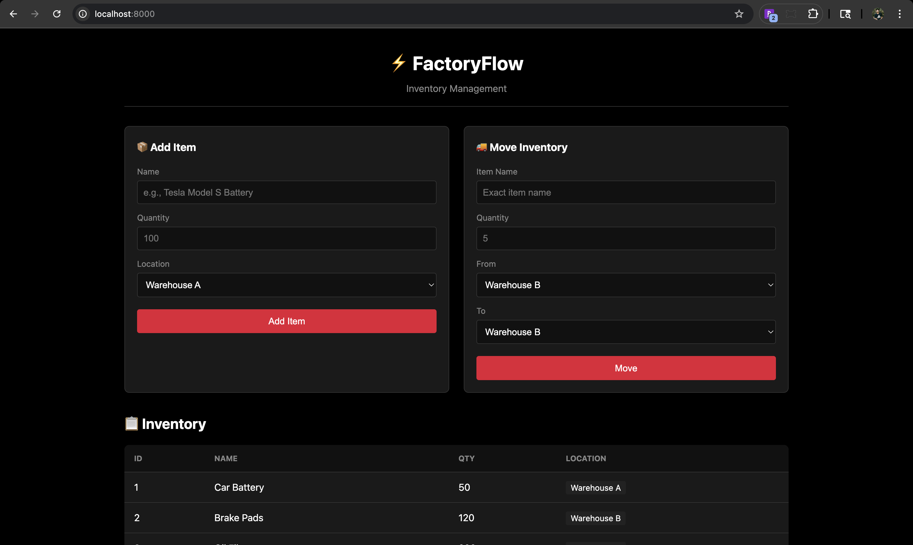
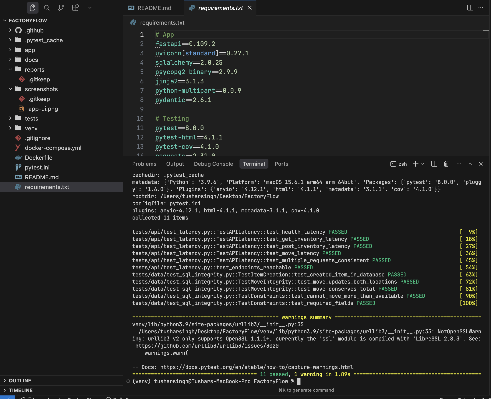

# FactoryFlow


## Demo

### App UI



### Tests Passing



## What This Is

Two parts:

1. **Target App** - Simple inventory management system (FastAPI + Postgres)
2. **Test Framework** - Comprehensive test suite that verifies the app

## Tech Stack

- Python 3.11, FastAPI, SQLAlchemy, PostgreSQL
- PyTest, Selenium, Requests
- Docker Compose, GitHub Actions

## Quick Start

```bash
# Start everything
docker compose up -d

# Install test deps
pip install -r requirements.txt

# Run tests
pytest tests/ -v
```

App runs at http://localhost:8000

## Project Structure

```
├── app/
│   ├── main.py          # FastAPI app
│   ├── models.py        # SQLAlchemy models
│   └── templates/       # HTML frontend
├── tests/
│   ├── api/             # Latency/SLA tests
│   ├── ui/              # Selenium tests (Page Object Model)
│   └── data/            # SQL verification tests
├── docker-compose.yml
└── .github/workflows/   # CI/CD
```

## Test Categories

### API Tests (`tests/api/test_latency.py`)

Tests response times against SLA thresholds. Fails if response > 200ms.

```bash
pytest tests/api/ -v -m api
```

### UI Tests (`tests/ui/test_frontend.py`)

Selenium tests using Page Object Model. Main test: add item, verify it shows in table.

```bash
pytest tests/ui/ -v -m ui
```

### Data Integrity Tests (`tests/data/test_sql_integrity.py`)

Query the database directly to verify operations actually happened. The API might return 200 OK without saving - these tests catch that.

```bash
pytest tests/data/ -v -m data
```

Key test from requirements:

1. Create item in Warehouse A with 100 qty
2. Move 5 to Warehouse B via API
3. Query SQL directly: verify A has 95, B has 5

## CI/CD

GitHub Actions runs all tests on push. Tests must pass to merge.

## Running Locally

```bash
# Just the database
docker compose up db -d

# Run app locally
uvicorn app.main:app --reload

# Run tests with visible browser
HEADLESS=false pytest tests/ui/ -v
```

## API Endpoints

- `GET /health` - Health check
- `GET /inventory` - List items
- `POST /inventory` - Add item
- `POST /move` - Move inventory between locations
- `GET /docs` - Swagger docs
